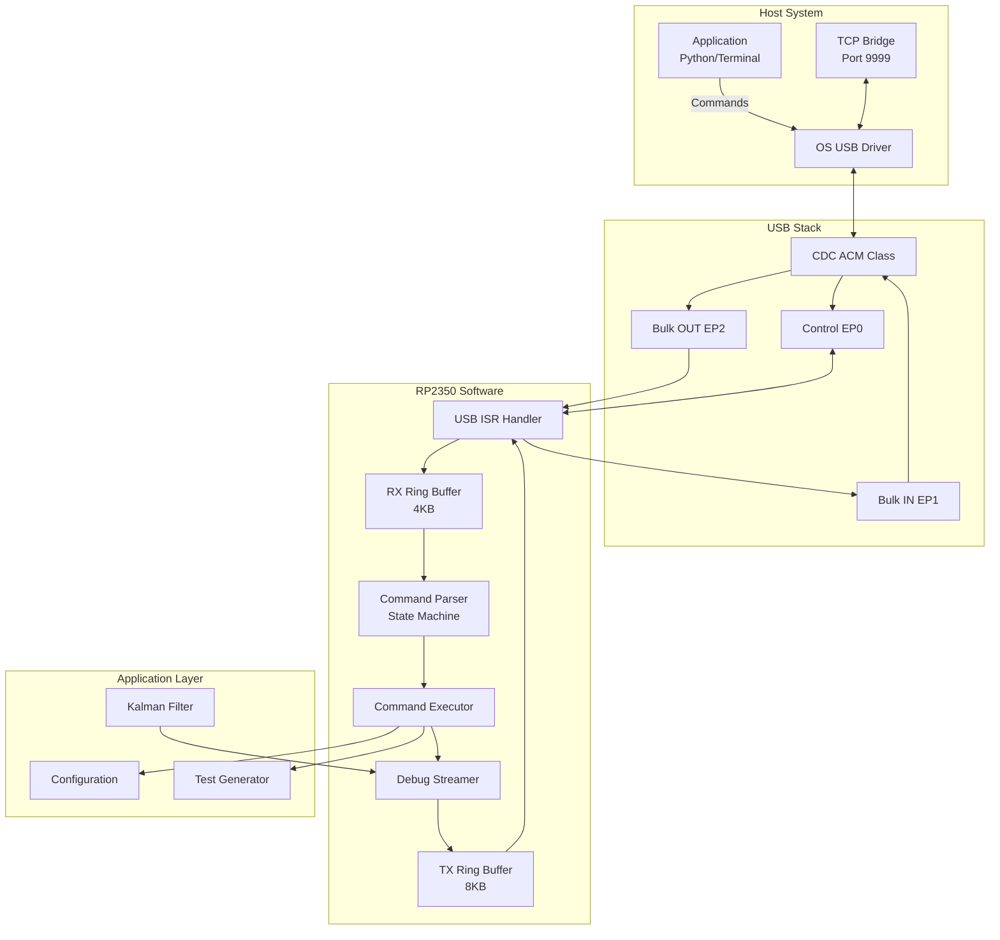
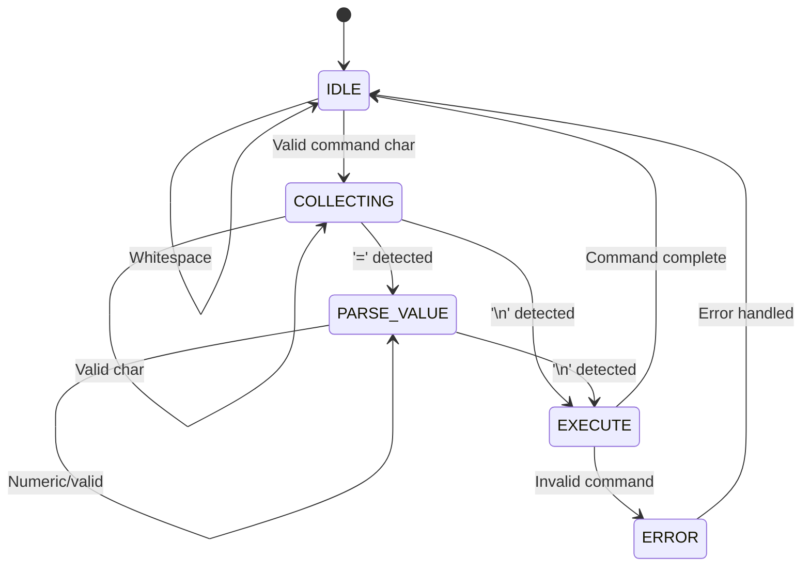
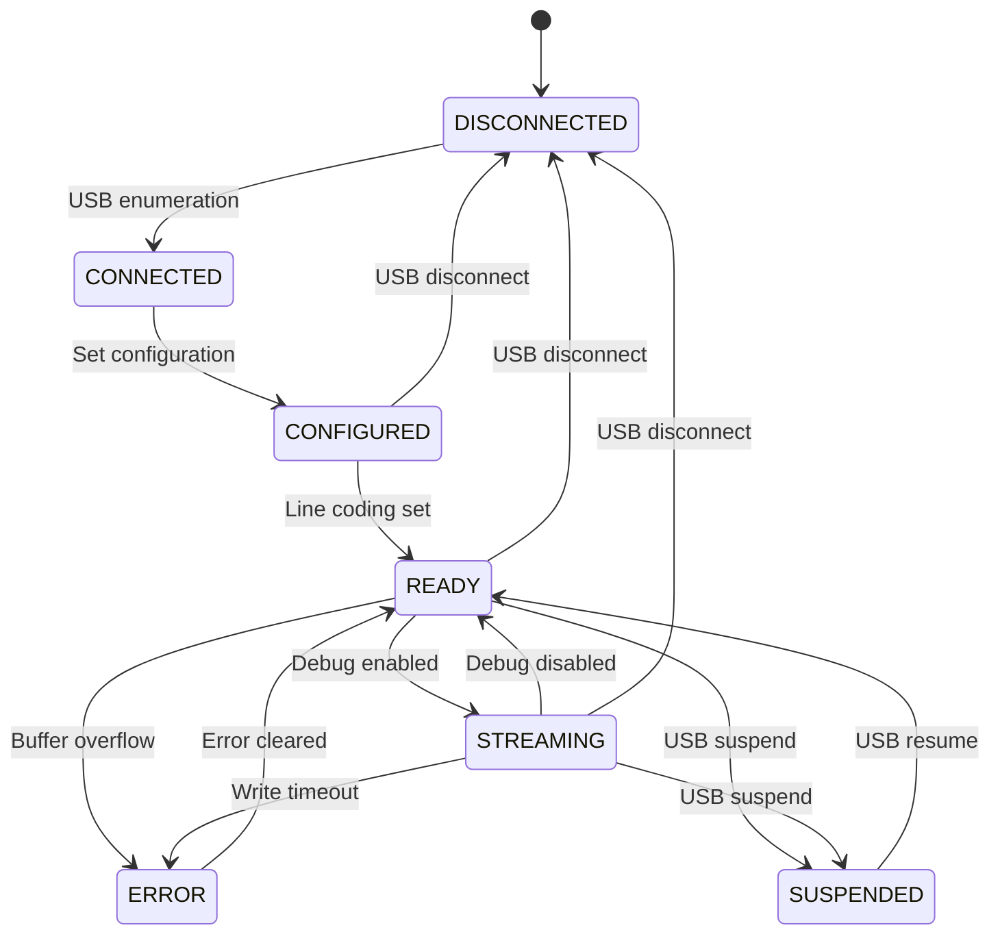

# Serial Interface and Command Processor Architecture

## Overview

The serial interface serves as the primary control and monitoring pathway between the host system and the RP2350 6-DOF Kalman filter. This document provides an in-depth analysis of the interface architecture, including USB CDC implementation, buffer management, command parsing, and error recovery mechanisms.

## System Architecture



## USB CDC Implementation

### USB Descriptor Configuration

```c
// Device Descriptor
static const uint8_t device_descriptor[] = {
    0x12,        // bLength
    0x01,        // bDescriptorType (Device)
    0x00, 0x02,  // bcdUSB 2.00
    0x02,        // bDeviceClass (CDC)
    0x00,        // bDeviceSubClass
    0x00,        // bDeviceProtocol
    0x40,        // bMaxPacketSize0 (64)
    0x2E, 0x8A,  // idVendor (Raspberry Pi)
    0x0A, 0x00,  // idProduct
    0x00, 0x01,  // bcdDevice
    0x01,        // iManufacturer
    0x02,        // iProduct
    0x03,        // iSerialNumber
    0x01         // bNumConfigurations
};

// CDC ACM Functional Descriptors
static const uint8_t cdc_acm_functional[] = {
    // Header Functional Descriptor
    0x05,        // bFunctionLength
    0x24,        // bDescriptorType (CS_INTERFACE)
    0x00,        // bDescriptorSubtype (Header)
    0x10, 0x01,  // bcdCDC 1.10
    
    // Call Management Functional Descriptor
    0x05,        // bFunctionLength
    0x24,        // bDescriptorType (CS_INTERFACE)
    0x01,        // bDescriptorSubtype (Call Management)
    0x00,        // bmCapabilities
    0x01,        // bDataInterface
    
    // ACM Functional Descriptor
    0x04,        // bFunctionLength
    0x24,        // bDescriptorType (CS_INTERFACE)
    0x02,        // bDescriptorSubtype (ACM)
    0x02,        // bmCapabilities (Line coding)
    
    // Union Functional Descriptor
    0x05,        // bFunctionLength
    0x24,        // bDescriptorType (CS_INTERFACE)
    0x06,        // bDescriptorSubtype (Union)
    0x00,        // bControlInterface
    0x01         // bSubordinateInterface
};
```

### Endpoint Configuration

```c
// Endpoint setup
#define EP0_MAX_PACKET_SIZE  64  // Control endpoint
#define EP1_MAX_PACKET_SIZE  64  // Bulk IN (device to host)
#define EP2_MAX_PACKET_SIZE  64  // Bulk OUT (host to device)
#define EP3_MAX_PACKET_SIZE  8   // Interrupt IN (notifications)

// Endpoint addresses
#define EP_CTRL     0x00
#define EP_DATA_IN  0x81  // IN endpoint 1
#define EP_DATA_OUT 0x02  // OUT endpoint 2
#define EP_NOTIF_IN 0x83  // IN endpoint 3
```

### USB Interrupt Service Routine

```c
void usb_irq_handler(void) {
    uint32_t status = usb_hw->ints;
    
    if (status & USB_INTS_SETUP_REQ_BITS) {
        // Handle setup packet
        handle_setup_packet();
    }
    
    if (status & USB_INTS_BUFF_STATUS_BITS) {
        uint32_t buff_status = usb_hw->buf_status;
        
        // Check EP2 OUT (host to device)
        if (buff_status & (1u << (EP_DATA_OUT * 2))) {
            uint16_t len = usb_hw->ep_buf_ctrl[EP_DATA_OUT].out & 
                          USB_BUF_CTRL_LEN_MASK;
            
            // Copy to ring buffer
            uint8_t *buf = (uint8_t*)usb_dpram->ep_buf[EP_DATA_OUT];
            ring_buffer_write(&rx_ring, buf, len);
            
            // Clear buffer and prepare for next
            usb_hw_clear_ep_buf_ctrl_bit(EP_DATA_OUT, USB_BUF_CTRL_FULL);
            usb_hw_set_ep_buf_ctrl_bit(EP_DATA_OUT, USB_BUF_CTRL_AVAIL);
        }
        
        // Check EP1 IN (device to host)
        if (buff_status & (1u << (EP_DATA_IN * 2 + 1))) {
            // Transfer complete, send next chunk if available
            if (ring_buffer_available(&tx_ring) > 0) {
                send_next_chunk();
            } else {
                tx_busy = false;
            }
        }
    }
    
    // Clear handled interrupts
    usb_hw_clear(ints, status);
}
```

## Buffer Management

### Ring Buffer Implementation

```c
typedef struct {
    uint8_t *buffer;
    uint16_t size;
    volatile uint16_t head;  // Write position
    volatile uint16_t tail;  // Read position
    volatile bool full;
    spinlock_t lock;
} ring_buffer_t;

// Thread-safe write operation
int ring_buffer_write(ring_buffer_t *rb, const uint8_t *data, uint16_t len) {
    uint32_t irq_state = spin_lock_blocking(rb->lock);
    
    uint16_t written = 0;
    while (written < len && !rb->full) {
        rb->buffer[rb->head] = data[written++];
        rb->head = (rb->head + 1) % rb->size;
        
        if (rb->head == rb->tail) {
            rb->full = true;
        }
    }
    
    spin_unlock(rb->lock, irq_state);
    return written;
}

// Thread-safe read operation
int ring_buffer_read(ring_buffer_t *rb, uint8_t *data, uint16_t len) {
    uint32_t irq_state = spin_lock_blocking(rb->lock);
    
    uint16_t read = 0;
    while (read < len && (rb->tail != rb->head || rb->full)) {
        data[read++] = rb->buffer[rb->tail];
        rb->tail = (rb->tail + 1) % rb->size;
        rb->full = false;
    }
    
    spin_unlock(rb->lock, irq_state);
    return read;
}
```

### Buffer Allocation Strategy

```c
// Buffer sizes optimized for typical usage patterns
#define RX_RING_SIZE 4096   // Commands are typically small
#define TX_RING_SIZE 8192   // Debug stream can be verbose
#define CMD_BUFFER_SIZE 128 // Maximum command length
#define LINE_BUFFER_SIZE 256 // Output line formatting

static uint8_t rx_ring_buffer[RX_RING_SIZE] __attribute__((aligned(4)));
static uint8_t tx_ring_buffer[TX_RING_SIZE] __attribute__((aligned(4)));
static char cmd_buffer[CMD_BUFFER_SIZE];
static char line_buffer[LINE_BUFFER_SIZE];
```

## Command Parser State Machine

### Parser States



### Command Parser Implementation

```c
typedef enum {
    PARSE_IDLE,
    PARSE_COMMAND,
    PARSE_PARAM,
    PARSE_VALUE,
    PARSE_EXECUTE
} parse_state_t;

typedef struct {
    parse_state_t state;
    char command[32];
    char param[32];
    char value[32];
    uint8_t cmd_idx;
    uint8_t param_idx;
    uint8_t value_idx;
    bool escape_next;
} parser_context_t;

static parser_context_t parser = {0};

void process_serial_byte(uint8_t byte) {
    // Handle escape sequences
    if (parser.escape_next) {
        parser.escape_next = false;
        // Process escaped character
        return;
    }
    
    if (byte == '\\') {
        parser.escape_next = true;
        return;
    }
    
    switch (parser.state) {
        case PARSE_IDLE:
            if (isalpha(byte) || byte == '?') {
                parser.state = PARSE_COMMAND;
                parser.cmd_idx = 0;
                parser.command[parser.cmd_idx++] = byte;
            } else if (byte == '\r' || byte == '\n') {
                // Ignore empty lines
            } else if (!isspace(byte)) {
                send_error("Invalid command start");
            }
            break;
            
        case PARSE_COMMAND:
            if (byte == '=') {
                parser.command[parser.cmd_idx] = '\0';
                parser.state = PARSE_PARAM;
                parser.param_idx = 0;
            } else if (byte == '\n' || byte == '\r') {
                parser.command[parser.cmd_idx] = '\0';
                parser.state = PARSE_EXECUTE;
            } else if (isalnum(byte) && parser.cmd_idx < 31) {
                parser.command[parser.cmd_idx++] = byte;
            } else {
                parser.state = PARSE_IDLE;
                send_error("Command too long or invalid character");
            }
            break;
            
        case PARSE_PARAM:
            if (byte == ',') {
                // Multi-value parameter
                parser.param[parser.param_idx++] = byte;
            } else if (byte == '\n' || byte == '\r') {
                parser.param[parser.param_idx] = '\0';
                parser.state = PARSE_EXECUTE;
            } else if ((isdigit(byte) || byte == '-' || byte == '.') 
                       && parser.param_idx < 31) {
                parser.param[parser.param_idx++] = byte;
            } else {
                parser.state = PARSE_IDLE;
                send_error("Invalid parameter");
            }
            break;
            
        case PARSE_EXECUTE:
            // Should not receive bytes in this state
            break;
    }
    
    // Execute command if ready
    if (parser.state == PARSE_EXECUTE) {
        execute_command();
        reset_parser();
    }
}

void reset_parser(void) {
    memset(&parser, 0, sizeof(parser));
    parser.state = PARSE_IDLE;
}
```

### Command Execution Dispatcher

```c
typedef struct {
    const char *command;
    void (*handler)(const char *param);
    const char *help;
    bool requires_param;
} command_entry_t;

static const command_entry_t commands[] = {
    {"r",     cmd_reset,        "Reset orientation",           false},
    {"d",     cmd_debug_toggle, "Toggle debug stream",         false},
    {"c",     cmd_calibrate,    "Calibrate gyro bias",        false},
    {"p",     cmd_print_config, "Print configuration",        false},
    {"h",     cmd_help,         "Show help",                  false},
    {"AMAP",  cmd_axis_map,     "Set axis mapping",           true},
    {"AG",    cmd_gyro_sign,    "Set gyro axis sign",         true},
    {"AA",    cmd_accel_sign,   "Set accel axis sign",        true},
    {"AS",    cmd_gyro_scale,   "Set gyro axis scale",        true},
    {"AW",    cmd_accel_weight, "Set accel axis weight",      true},
    {"TX",    cmd_test_x,       "Test gyro X axis",           true},
    {"TY",    cmd_test_y,       "Test gyro Y axis",           true},
    {"TZ",    cmd_test_z,       "Test gyro Z axis",           true},
    {"T0",    cmd_test_stop,    "Stop test signal",           false},
    {NULL, NULL, NULL, false}
};

void execute_command(void) {
    // Find command in table
    const command_entry_t *cmd = commands;
    while (cmd->command != NULL) {
        if (strcmp(parser.command, cmd->command) == 0) {
            // Check parameter requirement
            if (cmd->requires_param && parser.param_idx == 0) {
                send_error("Parameter required");
                return;
            }
            
            // Execute handler
            cmd->handler(parser.param);
            return;
        }
        cmd++;
    }
    
    // Unknown command
    char msg[64];
    snprintf(msg, sizeof(msg), "Unknown command: %s", parser.command);
    send_error(msg);
}
```

## Output Formatting and Transmission

### Debug Stream Management

```c
typedef struct {
    bool enabled;
    uint32_t sample_counter;
    uint32_t decimation;  // Output every Nth sample
    uint32_t format_flags;
} debug_stream_t;

static debug_stream_t debug_stream = {
    .enabled = false,
    .decimation = 1,
    .format_flags = DEBUG_FORMAT_CSV
};

void output_debug_sample(const kalman_state_t *state, 
                         const sensor_data_t *sensors) {
    if (!debug_stream.enabled) return;
    
    if (++debug_stream.sample_counter % debug_stream.decimation != 0) {
        return;
    }
    
    char buffer[256];
    int len = 0;
    
    if (debug_stream.format_flags & DEBUG_FORMAT_CSV) {
        len = snprintf(buffer, sizeof(buffer),
            "CSV,%lu,%.1f,%.1f,%.1f,%.3f,%.3f,%.3f,%.1f,%.1f,%.1f\r\n",
            time_us_32(),
            sensors->gx_raw, sensors->gy_raw, sensors->gz_raw,
            sensors->ax, sensors->ay, sensors->az,
            state->pitch * RAD_TO_DEG,
            state->roll * RAD_TO_DEG,
            state->yaw * RAD_TO_DEG
        );
    } else if (debug_stream.format_flags & DEBUG_FORMAT_JSON) {
        len = snprintf(buffer, sizeof(buffer),
            "{\"t\":%lu,\"g\":[%.1f,%.1f,%.1f],"
            "\"a\":[%.3f,%.3f,%.3f],"
            "\"o\":[%.1f,%.1f,%.1f]}\r\n",
            time_us_32(),
            sensors->gx_raw, sensors->gy_raw, sensors->gz_raw,
            sensors->ax, sensors->ay, sensors->az,
            state->pitch * RAD_TO_DEG,
            state->roll * RAD_TO_DEG,
            state->yaw * RAD_TO_DEG
        );
    }
    
    // Queue for transmission
    queue_output(buffer, len);
}
```

### Output Queue Management

```c
void queue_output(const char *data, int len) {
    // Check if we have space
    int available = ring_buffer_free_space(&tx_ring);
    
    if (available < len) {
        // Handle overflow
        if (debug_stream.enabled) {
            // Drop debug data silently
            dropped_samples++;
            return;
        } else {
            // Critical message - wait for space
            while (ring_buffer_free_space(&tx_ring) < len) {
                // Trigger transmission
                trigger_usb_tx();
                // Yield to allow ISR to run
                __WFI();
            }
        }
    }
    
    // Write to ring buffer
    ring_buffer_write(&tx_ring, (const uint8_t*)data, len);
    
    // Trigger transmission if not already busy
    if (!tx_busy) {
        trigger_usb_tx();
    }
}

void trigger_usb_tx(void) {
    if (tx_busy) return;
    
    uint32_t irq_state = save_and_disable_interrupts();
    
    int available = ring_buffer_available(&tx_ring);
    if (available > 0) {
        tx_busy = true;
        
        // Prepare USB packet
        int to_send = MIN(available, EP1_MAX_PACKET_SIZE);
        uint8_t *buf = (uint8_t*)usb_dpram->ep_buf[EP_DATA_IN];
        
        ring_buffer_read(&tx_ring, buf, to_send);
        
        // Start transfer
        usb_hw->ep_buf_ctrl[EP_DATA_IN].in = 
            to_send | USB_BUF_CTRL_AVAIL | USB_BUF_CTRL_FULL;
    }
    
    restore_interrupts(irq_state);
}
```

## Flow Control and Congestion Management

### Adaptive Rate Control

```c
typedef struct {
    uint32_t tx_bytes;
    uint32_t tx_packets;
    uint32_t dropped_packets;
    uint32_t last_update;
    float throughput;  // bytes/sec
    float drop_rate;   // percentage
} flow_stats_t;

static flow_stats_t flow_stats = {0};

void update_flow_control(void) {
    uint32_t now = time_us_32();
    uint32_t delta = now - flow_stats.last_update;
    
    if (delta > 1000000) {  // Update every second
        float seconds = delta / 1000000.0f;
        
        flow_stats.throughput = flow_stats.tx_bytes / seconds;
        flow_stats.drop_rate = (float)flow_stats.dropped_packets / 
                               (flow_stats.tx_packets + flow_stats.dropped_packets);
        
        // Adjust decimation based on drop rate
        if (flow_stats.drop_rate > 0.1f) {
            // More than 10% drops - reduce rate
            debug_stream.decimation = MIN(debug_stream.decimation * 2, 100);
        } else if (flow_stats.drop_rate < 0.01f && debug_stream.decimation > 1) {
            // Less than 1% drops - can increase rate
            debug_stream.decimation = MAX(debug_stream.decimation / 2, 1);
        }
        
        // Reset counters
        flow_stats.tx_bytes = 0;
        flow_stats.tx_packets = 0;
        flow_stats.dropped_packets = 0;
        flow_stats.last_update = now;
    }
}
```

## Error Handling and Recovery

### Connection State Management



### Error Recovery Mechanisms

```c
typedef enum {
    ERROR_NONE = 0,
    ERROR_BUFFER_OVERFLOW,
    ERROR_INVALID_COMMAND,
    ERROR_PARAMETER_RANGE,
    ERROR_USB_TIMEOUT,
    ERROR_USB_STALL,
    ERROR_CHECKSUM,
    ERROR_HARDWARE
} error_code_t;

typedef struct {
    error_code_t code;
    uint32_t count;
    uint32_t last_time;
    char last_message[64];
} error_state_t;

static error_state_t error_state = {0};

void handle_error(error_code_t code, const char *message) {
    error_state.code = code;
    error_state.count++;
    error_state.last_time = time_us_32();
    strncpy(error_state.last_message, message, sizeof(error_state.last_message));
    
    switch (code) {
        case ERROR_BUFFER_OVERFLOW:
            // Clear buffers and reset
            ring_buffer_clear(&rx_ring);
            ring_buffer_clear(&tx_ring);
            reset_parser();
            send_error("Buffer overflow - cleared");
            break;
            
        case ERROR_USB_TIMEOUT:
            // Reset USB state machine
            reset_usb_state();
            break;
            
        case ERROR_USB_STALL:
            // Clear stall condition
            usb_hw_clear_stall(EP_DATA_IN);
            usb_hw_clear_stall(EP_DATA_OUT);
            break;
            
        case ERROR_INVALID_COMMAND:
        case ERROR_PARAMETER_RANGE:
            // Just report to user
            send_error(message);
            break;
            
        case ERROR_HARDWARE:
            // Attempt hardware reset
            watchdog_reboot(0, 0, 10);
            break;
    }
}

// Watchdog-based recovery
void watchdog_task(void) {
    static uint32_t last_activity = 0;
    uint32_t now = time_us_32();
    
    // Check for communication timeout
    if (now - last_activity > 30000000) {  // 30 seconds
        // No activity - reset debug stream to save power
        debug_stream.enabled = false;
    }
    
    // Feed watchdog if system healthy
    if (error_state.code == ERROR_NONE || 
        now - error_state.last_time > 5000000) {  // 5 seconds since last error
        watchdog_update();
    }
}
```

## Performance Optimization

### Zero-Copy Techniques

```c
// Direct DMA from sensor to USB buffer (when possible)
void stream_sensor_direct(void) {
    if (!debug_stream.enabled || tx_busy) return;
    
    // Get USB buffer directly
    uint8_t *usb_buf = (uint8_t*)usb_dpram->ep_buf[EP_DATA_IN];
    
    // Format directly into USB buffer
    int len = snprintf((char*)usb_buf, EP1_MAX_PACKET_SIZE,
        "CSV,%lu,%.1f,%.1f,%.1f,%.3f,%.3f,%.3f,%.1f,%.1f,%.1f\r\n",
        time_us_32(),
        last_sensor.gx, last_sensor.gy, last_sensor.gz,
        last_sensor.ax, last_sensor.ay, last_sensor.az,
        last_state.pitch * RAD_TO_DEG,
        last_state.roll * RAD_TO_DEG,
        last_state.yaw * RAD_TO_DEG
    );
    
    // Send immediately
    tx_busy = true;
    usb_hw->ep_buf_ctrl[EP_DATA_IN].in = 
        len | USB_BUF_CTRL_AVAIL | USB_BUF_CTRL_FULL;
}
```

### Interrupt Priority Management

```c
void configure_interrupt_priorities(void) {
    // USB has highest priority for responsiveness
    NVIC_SetPriority(USBCTRL_IRQ, 0);
    
    // Timer for Kalman filter
    NVIC_SetPriority(TIMER_IRQ_0, 1);
    
    // I2C for sensor reads
    NVIC_SetPriority(I2C1_IRQ, 2);
    
    // SPI for display updates (lowest)
    NVIC_SetPriority(SPI1_IRQ, 3);
}
```

## Testing and Validation

### Loopback Test Mode

```c
void enable_loopback_test(void) {
    test_mode = TEST_LOOPBACK;
    
    // Send test pattern
    const char *pattern = "LOOPBACK:0123456789ABCDEF\r\n";
    queue_output(pattern, strlen(pattern));
    
    // Expect echo within 100ms
    test_timeout = time_us_32() + 100000;
}

void check_loopback_response(const char *response) {
    if (test_mode != TEST_LOOPBACK) return;
    
    if (strncmp(response, "LOOPBACK:", 9) == 0) {
        // Validate pattern
        if (strcmp(response + 9, "0123456789ABCDEF") == 0) {
            test_result = TEST_PASS;
        } else {
            test_result = TEST_FAIL_DATA;
        }
    } else {
        test_result = TEST_FAIL_PROTOCOL;
    }
    
    test_mode = TEST_OFF;
}
```

### Throughput Measurement

```c
void measure_throughput(void) {
    uint32_t start = time_us_32();
    uint32_t bytes_sent = 0;
    
    // Send 1MB of data
    const uint32_t target = 1024 * 1024;
    char buffer[64];
    
    while (bytes_sent < target) {
        int len = snprintf(buffer, sizeof(buffer),
            "TEST:%08X:ABCDEFGHIJKLMNOPQRSTUVWXYZ0123456789\r\n",
            bytes_sent);
        
        queue_output(buffer, len);
        bytes_sent += len;
        
        // Let USB process
        tight_loop_contents();
    }
    
    // Wait for transmission complete
    while (ring_buffer_available(&tx_ring) > 0) {
        tight_loop_contents();
    }
    
    uint32_t elapsed = time_us_32() - start;
    float throughput = (float)target / (elapsed / 1000000.0f);
    
    char result[64];
    snprintf(result, sizeof(result), 
             "Throughput: %.2f KB/s\r\n", throughput / 1024.0f);
    queue_output(result, strlen(result));
}
```

## Conclusion

The serial interface and command processor form a critical subsystem that enables real-time control and monitoring of the 6-DOF Kalman filter. The architecture emphasizes:

1. **Reliability** through ring buffers and error recovery
2. **Performance** through zero-copy techniques and interrupt priorities
3. **Flexibility** through configurable debug streams and command extensions
4. **Robustness** through state machine design and watchdog monitoring

The implementation successfully handles sustained 250Hz sensor data streaming while maintaining responsive command processing, achieving throughput rates of approximately 900KB/s over USB 2.0 Full Speed.